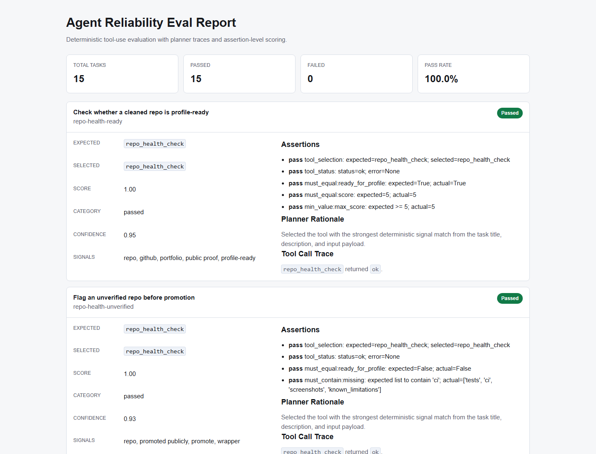

# Agent Reliability and Tool-Use Eval Lab

[](https://github.com/kundurukarthiksai-creator/agent-reliability-tool-use-eval-lab/actions/workflows/ci.yml)

Deterministic evaluation lab for tool-using AI agents. It runs structured tasks, asks an agent planner to choose a tool, records the tool-call trace, scores the result, and produces JSON plus HTML reports.

The default path is intentionally CI-safe: no API keys, no paid model calls, and no private data.



## What It Proves

- An agent can be evaluated on tool choice, not just final text.
- Tool calls are visible through traces.
- Failures are diagnosable at assertion level.
- Reports are reproducible from local fixtures.
- Run history can be persisted to SQLite.

## Current Features

- FastAPI backend.
- Deterministic rule-based planner.
- Tool registry with 4 local tools.
- 18 starter evaluation tasks.
- Assertion-level scoring.
- JSON report output.
- HTML report renderer and report API route.
- Deliberate failure demo for wrong tool selection.
- SQLite persistence for saved runs.
- Saved-run comparison API and HTML view.
- Saved-run trend summary API and HTML view.
- GitHub Actions CI.

## Quickstart

```powershell
python -m venv .venv
.\.venv\Scripts\python -m pip install -r requirements.txt
```

Run tests:

```powershell
.\.venv\Scripts\python -m pytest backend\tests -q
```

Run full local verification:

```powershell
.\.venv\Scripts\python scripts\check_all.py
```

Run the evaluation:

```powershell
.\.venv\Scripts\python scripts\run_eval.py
```

Render sample reports:

```powershell
.\.venv\Scripts\python scripts\render_dashboard.py
.\.venv\Scripts\python scripts\render_report.py
.\.venv\Scripts\python scripts\render_failure_demo.py
.\.venv\Scripts\python scripts\render_failure_catalog.py
.\.venv\Scripts\python scripts\compare_planners.py
.\.venv\Scripts\python scripts\render_run_comparison_demo.py
.\.venv\Scripts\python scripts\render_run_trends_demo.py
.\.venv\Scripts\python scripts\export_schemas.py
```

Run the API:

```powershell
.\.venv\Scripts\python -m uvicorn app.main:app --app-dir backend --reload
```

Open:

```text
http://127.0.0.1:8000/reports/latest.html
```

## API Routes

```text
GET  /
GET  /health
GET  /tools
GET  /planners/compare
GET  /planners/compare.html
POST /eval/run
POST /eval/runs
GET  /eval/runs
GET  /eval/runs.html
GET  /eval/runs/compare
GET  /eval/runs/compare.html
GET  /eval/runs/trends
GET  /eval/runs/trends.html
GET  /eval/runs/{run_id}
GET  /reports/latest.html
```

## Sample Artifacts

```text
reports/dashboard.html
reports/sample-eval-report.json
reports/sample-eval-report.html
reports/sample-failure-report.json
reports/sample-failure-report.html
reports/failure-catalog.json
reports/failure-catalog.html
reports/planner-comparison.json
reports/planner-comparison.md
reports/run-comparison-demo.json
reports/run-comparison-demo.html
reports/run-trends-demo.json
reports/run-trends-demo.html
```

The dashboard links the report, run history, run comparison, trends, and planner comparison views.
The failure sample intentionally chooses the wrong tool so the report shows how planner failures appear.
The failure catalog demonstrates `tool_selection`, `tool_execution`, and `output_assertion` categories.
The planner comparison shows the default planner against a deliberately weak baseline.
The run comparison demo shows how saved runs surface regressions and recoveries.
The run trends demo shows reliability movement across several saved runs.

## Project Layout

```text
backend/app/
  agent.py       deterministic planner
  registry.py    tool registry
  runner.py      evaluation orchestration
  scoring.py     assertion scoring
  reporting.py   HTML report rendering
  storage.py     SQLite persistence
  tools/         local deterministic tools
evals/
  tasks/         JSON evaluation tasks
  fixtures/      public-safe synthetic fixtures
reports/         generated sample outputs
docs/            architecture and methodology notes
```

## Known Limitations

- The default planner is rule-based, not an LLM planner.
- The starter eval set is small while tool contracts stabilize.
- Fixtures are synthetic/public-safe examples.
- CI proves deterministic behavior, not broad real-world agent generalization.
- Saved-run comparison needs at least two persisted runs.

## Roadmap

- Add more tools and harder task fixtures.
- Add optional LLM-backed planner comparison behind environment variables.
- Add a lightweight docs/demo deployment if it can stay free of secrets and recurring cost.

## Docs

- `STEERING.md`
- `docs/architecture.md`
- `docs/evaluation-methodology.md`
- `docs/commands.md`
- `docs/schemas.md`
- `docs/github-metadata.md`
